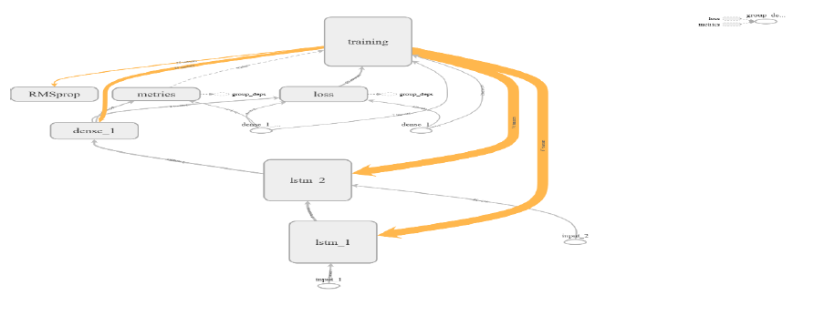
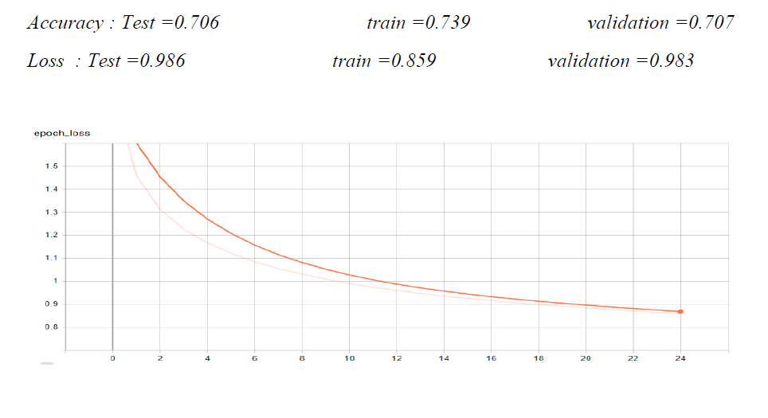
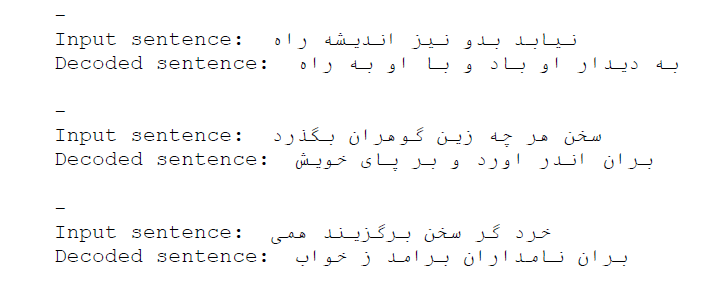

# RNN-network-for-generation-of-new-poems
## It is a class project that we want to engender new poem 

### In this project we are using a RNN network with 'teacher forcing' and our dataset is "Shahname" book by "Ferdosi" . we have used 10000 poems from this book and in any section we are giving first part of poem and our network must engender second part of poem shile it is so similar to reference .

our network has consist of encoder and decoder by LSTM network . in encoder we just convert characters of poem to a series of numbers and by decoder we reconvert it to poem .

### our network in Tensorboard

### accuracy of our model after 25 epochs

### some instance of our model that we have given first part of poem and our mode make second part of poem that it is defferent from book

